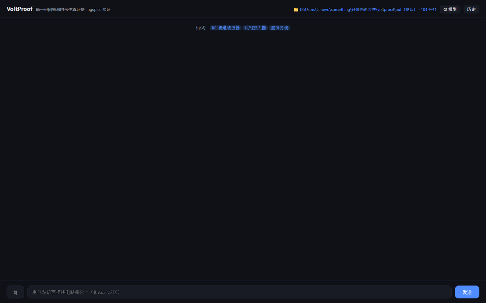
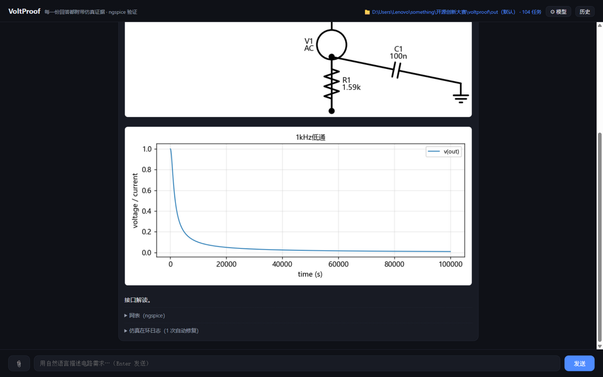
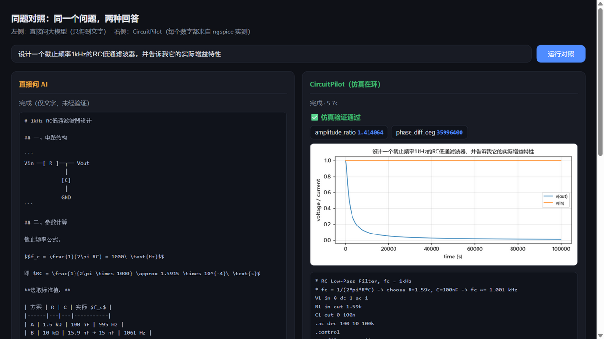

# VoltProof — 让 AI 的电路答案经过真实仿真验证

自然语言需求 → AI 生成 SPICE 网表 → **ngspice 真实仿真验证** → 波形 + 实测指标 + 原理图 + AI 解读。

> 直接问大模型，得到的是"关于电路的文字"；VoltProof 给出的是**被仿真验证过的电路**——
> 每一个数字都来自 ngspice 实测，指标不达标就自动带报错修复重试。

| 对话页 | 证据卡片（波形 + 指标 + 原理图 + 解读） | 同题对照页 |
|:---:|:---:|:---:|
|  |  |  |

## 它解决什么问题

大模型谈电路头头是道，但给出的网表经常**参数是编的、接法是错的**——而用户往往看不出来。
VoltProof 把 ngspice 仿真器放进闭环：AI 的每一次回答都要先过仿真这一关，

- **指标级验收**：不只判断"能仿真"，还实测纹波 / 截止频率 / 增益 / 主频等指标并与目标比对；
- **自动修复循环**：静态检查或仿真失败时，报错与偏差被喂回 LLM 迭代修正，而不是把错误留给用户；
- **证据可查**：波形图、指标数值、原理图、最终网表全部随回答给出，每个结论可复核。

同题对照页（`/compare.html`）把"直接问 AI"和"VoltProof"并排演示同一问题的两种回答。

## 特性

- **双轨后端**：LLM 直接写 SPICE 网表（默认），或写 [SKiDL](https://github.com/devbisme/skidl) Python 代码经沙箱构建——连接显式、无网表方言陷阱；
- **确定性原理图**：网表 → 二部图 → graphviz dot 布局 → schemdraw 渲染，LLM 不参与画图，拓扑 100% 正确；
- **多工作区**：产物与会话状态按任务归档在用户指定目录，切换工作区即切换项目；
- **前端可配模型**：任意 OpenAI 兼容供应商（DeepSeek / OpenAI / 本地 Ollama 等），⚙ 一键切换，密钥只存本机、永不回传；
- **安全设计**：ngspice 危险命令拦截、生成代码 AST 沙箱 + 最小环境、供应商地址 SSRF 校验。

## 快速开始

```bash
# 0. 环境：Python 3.10+（3.13 实测）；ngspice（SourceForge 下载解压即可）
setx VOLTPROOF_NGSPICE "C:\path\to\ngspice-47\Spice64\bin\ngspice.exe"   # Windows；已进 PATH 可跳过

# 1. 安装依赖
pip install -r requirements.txt

# 2. 配置模型（二选一）
#    a) 环境变量（也接受 DEEPSEEK_API_KEY / OPENAI_API_KEY）
setx VOLTPROOF_API_KEY 你的key
#    b) 启动后在页面右上角 ⚙ 模型 里填写（任意 OpenAI 兼容供应商，保存到本机 settings.json）

# 3. 离线自检（不需要 API Key，验证仿真链路/检查器/沙箱/接口契约）
python tests/test_offline.py
python tests/test_pipeline_mock.py

# 4. 启动
uvicorn app.main:app --reload
# 浏览器打开 http://127.0.0.1:8000（对话页）
# 同题对照演示：http://127.0.0.1:8000/compare.html
```

## 使用指南

- **对话**：直接用自然语言描述需求，例如"设计桥式整流+电容滤波电路，220V/50Hz 降压到 12V，纹波 <1V"。可附上网表或文本文件让 VoltProof 分析/改进。
- **证据卡片**：每份回答附判定（达标/未达标）、实测指标、波形图、原理图、AI 解读，以及完整网表——复核或搬到别处仿真都方便。
- **多轮迭代**：会话内继续提要求（"把纹波再压一半"），VoltProof 会携带上一轮验证过的网表继续改。
- **工作区**：顶栏可切换/查看当前工作区，"历史"面板列出全部历史任务与产物，拷走工作区目录即完整归档。
- **模型配置**：⚙ 弹层里可填供应商 Base URL / API Key / 模型名（可拉取供应商模型列表下拉选择）。本机 Ollama / LM Studio 需机主设置 `VOLTPROOF_ALLOW_PRIVATE_LLM=1` 豁免内网校验。
- **命令行**：`python -m app.pipeline "设计一个截止频率1kHz的RC低通滤波器"` 直接跑完整管道。

## 环境变量

| 变量 | 必填 | 说明 |
|---|---|---|
| `VOLTPROOF_API_KEY` | 是* | OpenAI 兼容 API Key（*也可在前端 ⚙ 里配置；另接受 `DEEPSEEK_API_KEY` / `OPENAI_API_KEY`） |
| `VOLTPROOF_BASE_URL` | 否 | 默认 `https://api.deepseek.com`，任意 OpenAI 兼容网关 |
| `VOLTPROOF_MODEL` | 否 | 默认 `deepseek-flash` |
| `VOLTPROOF_NGSPICE` | 视环境 | ngspice 可执行文件完整路径；已在 PATH 中可省略 |
| `VOLTPROOF_SETTINGS` | 否 | settings.json 路径（默认仓库根目录） |
| `VOLTPROOF_LLM_TIMEOUT` | 否 | 单次 LLM 调用超时秒数，默认 480（推理型模型长思考需要） |
| `VOLTPROOF_LLM_RETRIES` | 否 | SDK 对超时/断连/429/5xx 的自动重试次数，默认 2 |
| `VOLTPROOF_THINKING` | 否 | 思考模式总开关 on/off，默认 on |
| `VOLTPROOF_REASONING_EFFORT` | 否 | none/low/high/max，默认不传 |
| `VOLTPROOF_SIM_TIMEOUT` | 否 | 单次仿真超时秒数，默认 30 |
| `VOLTPROOF_CACHE` | 否 | 结果缓存开关，默认开（`0` 关闭） |
| `VOLTPROOF_DOT` | 否 | graphviz dot.exe 路径（缺省尝试常见安装位置；不可用时回退网格布局） |
| `VOLTPROOF_WORKSPACE` | 否 | 启动时绑定工作区目录（缺省用仓库 `out/`，运行中可经页面切换） |
| `VOLTPROOF_ALLOW_PRIVATE_LLM` | 否 | 豁免供应商地址的内网/环回校验（本机 Ollama 等用），默认 off |

## 基准测试（bench）

```bash
python bench/run_bench.py                # 10 个典型电路任务，spice 后端
python bench/run_bench.py --backend=skidl
```

任务覆盖 RC/LC 滤波、整流滤波、反相放大、共射放大、张弛振荡、传感器调理等分立元件典型电路；验收是**指标级**的——纹波上限、截止频率、增益、振荡频率等逐项与理论值比对，而非仅判"仿真能跑"。历史最佳全量通过（10/10），综合实验（多信号合成/谐波分析）实测谐波比与理论值吻合（a3/a1≈1/3、a5/a1≈0.2）。

## 安全边界

VoltProof 按**本地单机工具**设计（请绑定 127.0.0.1 使用）。已实现的防护（均有回归测试）：

- ngspice `.control` 内 `shell/system/alias/...` 系统命令与外部程序调用一律拦截；`.include/.lib` 仅允许相对路径；
- LLM 生成代码在受限子进程中执行（AST 白名单 + 最小环境，不携带任何凭据）；
- 供应商 Base URL 做 SSRF 校验（拒绝环回/内网/保留地址）；
- 上传附件 ≤256KB、正文 ≤8KB（前后端双重限制）。

公网部署前必须自行增加鉴权与速率限制，并叠加 OS 级（容器）隔离——见各端点文档说明。

## 相关工作与定位

LLM 生成 SPICE 网表近年已有学术工作：AnalogCoder（AAAI'25，IC 级电路）、PowerElecLLM（650 题但仅 DC-DC 域）、skidl-spec2circuit（6 任务）、NetlistBench（只测网表编辑、不仿真）。VoltProof 的差异点：**面向分立元件典型电路与教学/实验场景，以开源 ngspice 为后端的完整"生成→检查→仿真→指标验收→修复"闭环**，并附带可复现的基准任务与指标级验收器。

## 路线图

- 教育/实验场景：实验报告一键导出（波形+指标+网表组装成文档）、what-if 参数扫描对比；
- bench 升级：pass@k 多轮统计、难度分层、埋错自验收（用已知坏电路验证验收器）、任务扩容；
- MCP 服务器：把"生成电路/跑仿真/取波形"暴露为 MCP 工具，接入 Claude/Cursor 等生态；
- 修复环引入波形多模态诊断。

## 许可证

Apache-2.0（见 [LICENSE](LICENSE)）。依赖均为宽松协议：ngspice(BSD)、spyci(MIT)、skidl(MIT)、schemdraw(MIT)、FastAPI(MIT)、matplotlib(PSF)；不使用 GPL 组件，ngspice 与 graphviz 均以子进程调用。
